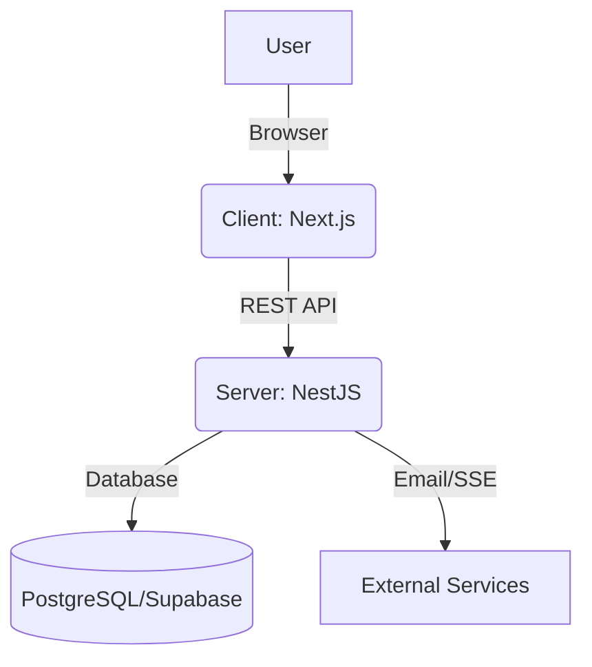

#  Flight Booking System

Welcome to the Flight Booking System monorepo! This project is a full-stack application designed to provide a seamless experience for searching, booking, and managing flights. It is organized into two main components: a **Next.js React client** and a **NestJS server** backend.

---

## 📚 Table of Contents
1. [Project Overview](#project-overview)
2. [High-Level Architecture](#high-level-architecture)
3. [Client (Frontend)](#client-frontend)
4. [Server (Backend)](#server-backend)
5. [Getting Started](#getting-started)
6. [Further Reading](#further-reading)

---
## FOr demo
```
http://54.169.144.111/
```

## Project Overview
This system allows users to:
- Search for flights between airports
- Book flights and manage bookings
- View booking history and user profiles
- Authenticate securely

The project is containerized using Docker and orchestrated with Docker Compose for easy local development and deployment.

---

## High-Level Architecture



- **Client (Next.js):** Handles all user interactions, UI rendering, and communicates with the backend via REST APIs.
- **Server (NestJS):** Manages business logic, authentication, flight and booking data, and interfaces with the database and external services.
- **Database:** Stores user, flight, and booking information (see server documentation for details).

---

## Client (Frontend)
- **Framework:** Next.js (React)
- **Location:** [`client/`](./client)
- **Features:**
  - Modern, responsive UI
  - Flight search and booking
  - User authentication and profile management
- **Documentation:**
  - [Client README](./client/README.md)
  - [Client Architecture](./client/src/app/architecture.md)

---

## Server (Backend)
- **Framework:** NestJS (Node.js)
- **Location:** [`server/`](./server)
- **Features:**
  - RESTful API for flights, bookings, users
  - Authentication and authorization
  - Integration with PostgreSQL/Supabase
  - Email notifications, SSE for real-time updates
- **Documentation:**
  - [Server README](./server/README.md)
  - [Server Architecture](./server/ARCHITECTURE.md)

---

## Getting Started

1. **Clone the repository:**
   ```bash
   git clone <repo-url>
   cd Flight-booking-syatem
   ```
2. **Start with Docker Compose:**
   ```bash
   docker-compose up --build
   ```
3. **Access the app:**
   - Client: [http://localhost:3000](http://localhost:3000)
   - Server API: [http://localhost:5000](http://localhost:5000)

---

## Further Reading
- [Client README](./client/README.md)
- [Client Architecture](./client/src/app/architecture.md)
- [Server README](./server/README.md)
- [Server Architecture](./server/ARCHITECTURE.md)

---

> _"This project is designed as a learning resource and a foundation for building robust, scalable booking systems. Explore the code, read the docs, and enjoy your journey!"_
