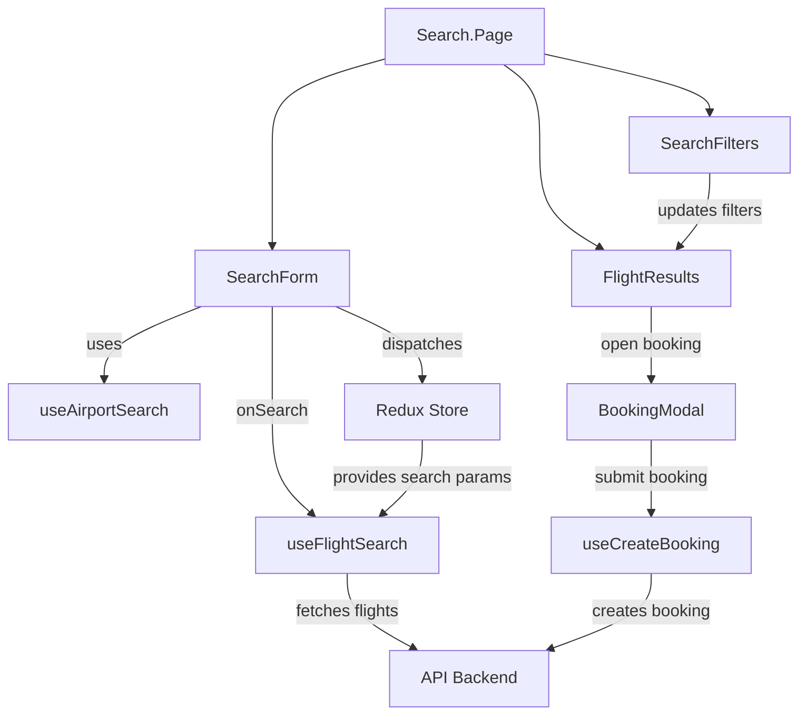
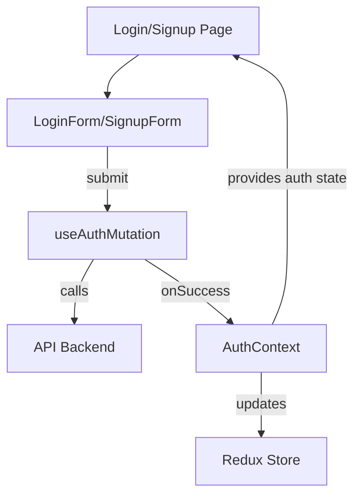
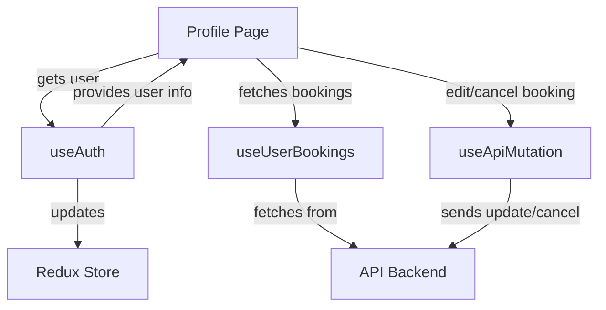

# Flight Booking System Architecture

## Overview
The Flight Booking System is a full-stack web application consisting of a Next.js (React) client and a backend API (e.g., Node.js/NestJS). The system allows users to search for flights, book tickets, and manage their profiles.

---

## High-Level Architecture

```mermaid
graph TD
  A[User Browser]
  B[Next.js Client (Frontend)]
  C[Backend API (NestJS/Node.js)]
  D[Database (e.g., PostgreSQL)]
  E[External APIs (Flight Data)]

  A -- HTTP/HTTPS --> B
  B -- REST/GraphQL --> C
  C -- SQL --> D
  C -- HTTP/HTTPS --> E
```

---

## Components

### 1. Next.js Client (Frontend)
- **Pages**: Search, Booking, Profile, Login
- **Components**: Navbar, Search Form, Booking Modal, etc.
- **State Management**: React Context, custom hooks
- **API Communication**: Uses `NEXT_PUBLIC_API_URL` to talk to backend
- **Authentication**: Handles login, stores tokens (if any)

### 2. Backend API (NestJS/Node.js)
- **Endpoints**: Flights, Bookings, Users, Auth
- **Business Logic**: Flight search, booking validation, user management
- **Database Access**: Reads/writes to SQL database
- **External Integrations**: May fetch real-time flight data from third-party APIs

### 3. Database
- Stores users, flights, bookings, etc.
- Example: PostgreSQL

### 4. External APIs
- Used for real-time flight data, payment, etc.

---

## Data Flow
1. **User** interacts with the **Next.js client** in the browser.
2. The client sends requests to the **Backend API** (URL set by `NEXT_PUBLIC_API_URL`).
3. The backend processes requests, interacts with the **Database** and/or **External APIs**.
4. Responses are sent back to the client and rendered for the user.

---

## Deployment
- **Frontend**: Dockerized Next.js app (see README)
- **Backend**: Separate service, also dockerized
- **Environment Variables**: Used for API URLs, secrets, etc.

---

## Extensibility
- Add more pages/components to the client
- Extend backend with new endpoints or integrations
- Swap database or external APIs as needed 

---

## Screenshots

> Add screenshots of your application below. Place images in the `public/` directory and reference them here.

 

---

## Low-Level Architecture (Frontend)

### Component & Data Flow (Search/Booking)



### Explanation
- **Search.Page**: Orchestrates the search flow, manages search/filter state, and renders child components.
- **SearchForm**: Handles user input for flight search, uses `useAirportSearch` for autocomplete, and triggers search via `onSearch`.
- **useAirportSearch**: Fetches airport suggestions from backend or local data.
- **useFlightSearch**: Fetches flight results from backend based on search params (from form/Redux).
- **SearchFilters**: Lets users filter results (price, airline, stops, etc.), updates state in parent.
- **FlightResults**: Displays filtered/sorted flights, allows user to open `BookingModal`.
- **BookingModal**: Collects passenger info and submits booking using `useCreateBooking`.
- **useCreateBooking**: Sends booking data to backend API.
- **Redux Store**: Stores search params and other global state, used by hooks/components.
- **API Backend**: Receives search and booking requests, returns data.

### State Management
- **React State**: Used for local UI state (form fields, modals, filters).
- **Redux**: Used for global state (search params, user info).
- **React Query**: Used for data fetching, caching, and mutation (flights, bookings, airports).

--- 

---

## Low-Level Architecture: Authentication Flow



**Explanation:**
- **Login/Signup Page**: Renders login and signup forms.
- **LoginForm/SignupForm**: Handles user input and validation, submits data via `useAuthMutation`.
- **useAuthMutation**: Calls backend API for login/signup, updates `AuthContext` on success.
- **AuthContext**: Stores user/auth state, provides it to the app, updates Redux if needed.
- **Redux Store**: May store user info or tokens for global access.
- **API Backend**: Handles authentication, returns tokens/user info.

---

## Low-Level Architecture: Profile Management Flow



**Explanation:**
- **Profile Page**: Displays user info and booking history, allows profile edits and password changes.
- **useAuth**: Provides current user info and logout functionality.
- **useUserBookings**: Fetches user's bookings from backend.
- **useApiMutation**: Used for profile updates, password changes, and booking cancellations.
- **API Backend**: Handles all profile and booking-related requests.
- **Redux Store**: May be updated with new user info after edits.

--- 